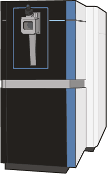
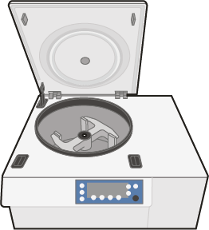
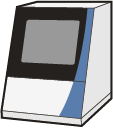
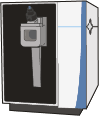
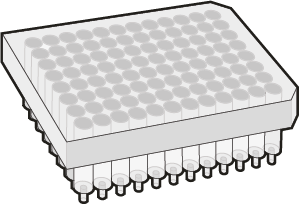
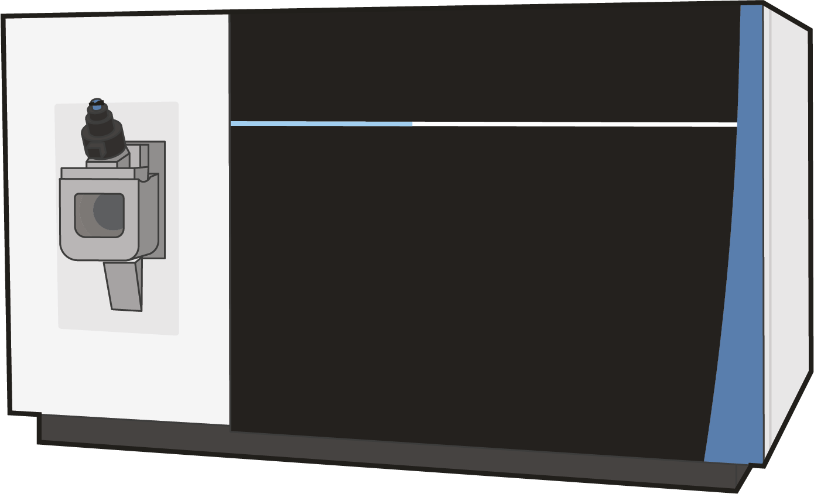
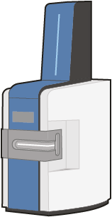
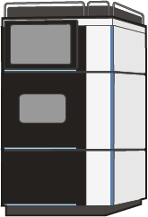
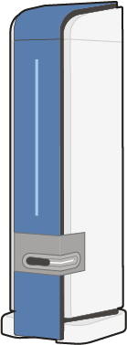
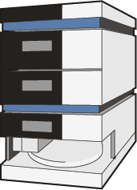

**All illustrations below are licensed under [CC-BY-4.0](https://creativecommons.org/licenses/by/4.0/deed.en). Do not forget to attribute them to the artist.**

|Image|PNG|Adobe Illustrator|Description|Artist|Comment|
|:-:|---|---|---|---|---|
||[astral.png](astral.png)|[astral.ai](astral.ai)|Astral mass spectrometer|[Manon Zuurmond](https://orcid.org/0009-0001-3017-0401)|   |
||[centrifuge.png](centrifuge.png)|[centrifuge.ai](centrifuge.ai)|Laboratory centrifuge|[Manon Zuurmond](https://orcid.org/0009-0001-3017-0401)|   |
||[easy_nlc.png](easy_nlc.png)|[easy_nlc.ai](easy_nlc.ai)|Proxeon EASY-nLC system|[Manon Zuurmond](https://orcid.org/0009-0001-3017-0401)|   |
||[exploris480.png](exploris480.png)|[exploris480.ai](exploris480.ai)|Exploris 480 mass spectrometer|[Manon Zuurmond](https://orcid.org/0009-0001-3017-0401)|   |
||[filter_plate_96.png](filter_plate_96.png)|[filter_plate_96.ai](filter_plate_96.ai)|96-well filter plate|[Manon Zuurmond](https://orcid.org/0009-0001-3017-0401)|   |
||[lumos.png](lumos.png)|[lumos.ai](lumos.ai)|Orbitrap Fusion Lumos mass spectrometer|[Manon Zuurmond](https://orcid.org/0009-0001-3017-0401)|   |
||[maldi2_timsTOF.png](maldi2_timsTOF.png)|[maldi2_timsTOF.ai](maldi2_timsTOF.ai)|timsTOF fleX MALDI-2 mass spectrometer|[Manon Zuurmond](https://orcid.org/0009-0001-3017-0401)|   |
||[neo_UHPLC_system.png](neo_UHPLC_system.png)|[neo_UHPLC_system.ai](neo_UHPLC_system.ai)|Neo UHPLC system|[Manon Zuurmond](https://orcid.org/0009-0001-3017-0401)|   |
||[rapifleX.png](rapifleX.png)|[rapifleX.ai](rapifleX.ai)|rapifleX mass spectrometer|[Manon Zuurmond](https://orcid.org/0009-0001-3017-0401)|   |
||[ultimate3000.png](ultimate3000.png)|[ultimate3000.ai](ultimate3000.ai)|Ultimate 3000 UHPLC system|[Manon Zuurmond](https://orcid.org/0009-0001-3017-0401)|   |

All of these images are licensed under CC-BY-4.0, and may be used by anyone in publications with the appropriate attribution in the figure caption or acknowledgement. These illustrations complement those in [NIH's BioArt](https://bioart.niaid.nih.gov/), and are consistent in style. Most BioArt content is provided under CC-BY-4.0 or CC0. The matching style and compatible licenses simplifies describing experimental workflows in figures using professional illustrations created by human scientific illustrators without the aid of AI.

To attribute the artist, please include a statement like "Selected graphical elements in this figure, including [list specific elements], were designed by Manon Zuurmond and are used under a CC BY license.". Do not forget to also attribute any graphical elements from BioArt to their creators (see [BioArt FAQ](https://bioart.niaid.nih.gov/faqs)).
